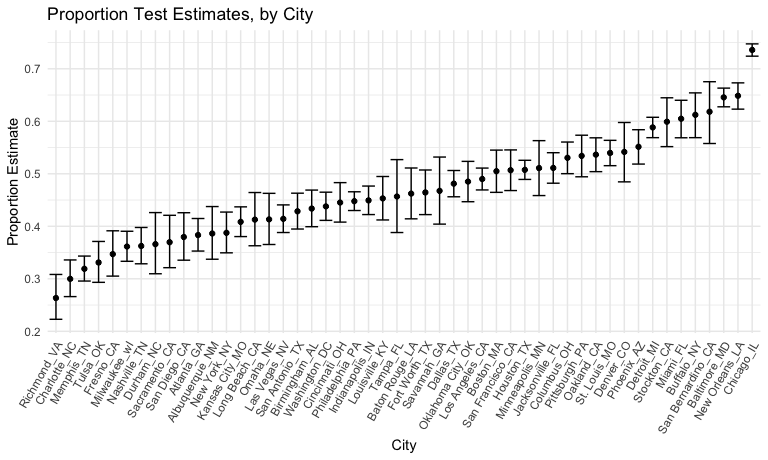

Iterations
================
Binyam Yilma
11/16/2020

\#\#Problem 1

Data Import + Tidy

``` r
homicide_df = 
  read_csv("./data/homicide-data.csv") %>% 
  mutate(
    city_state = str_c(city, state, sep = "_"),
    resolved = case_when(
      disposition == "Closed without arrest" ~ "unsolved",
      disposition == "Open/No arrest"        ~ "unsolved",
      disposition == "Closed by arrest"      ~ "solved",
    )
  ) %>% 
  filter(city_state != "Tulsa_AL")

homicide_df %>% 
  select(city_state, resolved) %>% 
  filter(city_state != "Tulsa_AL")
```

    ## # A tibble: 52,178 x 2
    ##    city_state     resolved
    ##    <chr>          <chr>   
    ##  1 Albuquerque_NM unsolved
    ##  2 Albuquerque_NM solved  
    ##  3 Albuquerque_NM unsolved
    ##  4 Albuquerque_NM solved  
    ##  5 Albuquerque_NM unsolved
    ##  6 Albuquerque_NM unsolved
    ##  7 Albuquerque_NM solved  
    ##  8 Albuquerque_NM solved  
    ##  9 Albuquerque_NM unsolved
    ## 10 Albuquerque_NM unsolved
    ## # … with 52,168 more rows

The dataframe `homicide_df` contains information on homicides in 50
large U.S. cities. The dataset contains52178 rows and 14 columns, which
contain information such as:reported\_date, city, state, victim\_race,
victim\_age, disposition.

``` r
# homicide_df %>% 
#   select(city_state, resolved, city, state) %>% 
#   View()

aggregate_df = homicide_df %>% 
  group_by(city_state) %>% 
  summarize(
   `total_homicide` = n(),
   `num_unsolved` = sum(resolved == "unsolved")
  ) 
```

    ## `summarise()` ungrouping output (override with `.groups` argument)

``` r
aggregate_df %>% 
  knitr::kable()
```

| city\_state        | total\_homicide | num\_unsolved |
| :----------------- | --------------: | ------------: |
| Albuquerque\_NM    |             378 |           146 |
| Atlanta\_GA        |             973 |           373 |
| Baltimore\_MD      |            2827 |          1825 |
| Baton Rouge\_LA    |             424 |           196 |
| Birmingham\_AL     |             800 |           347 |
| Boston\_MA         |             614 |           310 |
| Buffalo\_NY        |             521 |           319 |
| Charlotte\_NC      |             687 |           206 |
| Chicago\_IL        |            5535 |          4073 |
| Cincinnati\_OH     |             694 |           309 |
| Columbus\_OH       |            1084 |           575 |
| Dallas\_TX         |            1567 |           754 |
| Denver\_CO         |             312 |           169 |
| Detroit\_MI        |            2519 |          1482 |
| Durham\_NC         |             276 |           101 |
| Fort Worth\_TX     |             549 |           255 |
| Fresno\_CA         |             487 |           169 |
| Houston\_TX        |            2942 |          1493 |
| Indianapolis\_IN   |            1322 |           594 |
| Jacksonville\_FL   |            1168 |           597 |
| Kansas City\_MO    |            1190 |           486 |
| Las Vegas\_NV      |            1381 |           572 |
| Long Beach\_CA     |             378 |           156 |
| Los Angeles\_CA    |            2257 |          1106 |
| Louisville\_KY     |             576 |           261 |
| Memphis\_TN        |            1514 |           483 |
| Miami\_FL          |             744 |           450 |
| Milwaukee\_wI      |            1115 |           403 |
| Minneapolis\_MN    |             366 |           187 |
| Nashville\_TN      |             767 |           278 |
| New Orleans\_LA    |            1434 |           930 |
| New York\_NY       |             627 |           243 |
| Oakland\_CA        |             947 |           508 |
| Oklahoma City\_OK  |             672 |           326 |
| Omaha\_NE          |             409 |           169 |
| Philadelphia\_PA   |            3037 |          1360 |
| Phoenix\_AZ        |             914 |           504 |
| Pittsburgh\_PA     |             631 |           337 |
| Richmond\_VA       |             429 |           113 |
| Sacramento\_CA     |             376 |           139 |
| San Antonio\_TX    |             833 |           357 |
| San Bernardino\_CA |             275 |           170 |
| San Diego\_CA      |             461 |           175 |
| San Francisco\_CA  |             663 |           336 |
| Savannah\_GA       |             246 |           115 |
| St. Louis\_MO      |            1677 |           905 |
| Stockton\_CA       |             444 |           266 |
| Tampa\_FL          |             208 |            95 |
| Tulsa\_OK          |             583 |           193 |
| Washington\_DC     |            1345 |           589 |

``` r
p_test = prop.test(
  aggregate_df %>% filter(city_state == "Baltimore_MD") %>% pull(num_unsolved), 
  aggregate_df %>% filter(city_state == "Baltimore_MD") %>% pull(total_homicide)
  ) %>% 
  broom::tidy() %>% select(estimate, conf.low, conf.high)


p_test %>% 
  knitr::kable()
```

|  estimate |  conf.low | conf.high |
| --------: | --------: | --------: |
| 0.6455607 | 0.6275625 | 0.6631599 |

``` r
prop_test = aggregate_df %>% 
  mutate(
    prop_tests = map2(.x = num_unsolved, .y = total_homicide, ~prop.test(x = .x, n = .y)),
    tidy_tests = map(.x = prop_tests, ~broom::tidy(.x))
  ) %>% 
  select(-prop_tests) %>% 
  unnest(tidy_tests) %>% 
  select(city_state, estimate, conf.low, conf.high)
```

Making a plot of the proption test estimates, with confidence intervals,
by city. The proportion test here tests whether the proportion of
unsolved homicide cases is equal to the proprtion of solved homicide
cases.

``` r
prop_test %>% 
  mutate(city_state = fct_reorder(city_state, estimate)) %>% 
  ggplot(aes(x = city_state, y = estimate)) +
  geom_point() + 
  geom_errorbar(aes(ymin = conf.low, ymax = conf.high)) + 
  theme(axis.text.x = element_text(angle = 60, vjust = 1.0, hjust = 1)) + 
  labs(
    title = "Proportion Test Estimates, by City",
    x = "City",
    y = "Proportion Estimate"
  )
```



We notice that the `Chicago_IL` has the highest number of unsolved
homicide cases, followed up `New_Orleans_LA`. By contrast, `Richmond_VA`
has the lowest unsolved homicide rate, followed by `Charlotte_NC`.

\#\#Problem 2

``` r
read_csv("./data/lda_data/con_01.csv") 
```

    ## Parsed with column specification:
    ## cols(
    ##   week_1 = col_double(),
    ##   week_2 = col_double(),
    ##   week_3 = col_double(),
    ##   week_4 = col_double(),
    ##   week_5 = col_double(),
    ##   week_6 = col_double(),
    ##   week_7 = col_double(),
    ##   week_8 = col_double()
    ## )

    ## # A tibble: 1 x 8
    ##   week_1 week_2 week_3 week_4 week_5 week_6 week_7 week_8
    ##    <dbl>  <dbl>  <dbl>  <dbl>  <dbl>  <dbl>  <dbl>  <dbl>
    ## 1    0.2  -1.31   0.66   1.96   0.23   1.09   0.05   1.94

``` r
list.files(path = "./data/lda_data")
```

    ##  [1] "con_01.csv" "con_02.csv" "con_03.csv" "con_04.csv" "con_05.csv"
    ##  [6] "con_06.csv" "con_07.csv" "con_08.csv" "con_09.csv" "con_10.csv"
    ## [11] "exp_01.csv" "exp_02.csv" "exp_03.csv" "exp_04.csv" "exp_05.csv"
    ## [16] "exp_06.csv" "exp_07.csv" "exp_08.csv" "exp_09.csv" "exp_10.csv"

``` r
read_csv("./data/lda_data/con_01.csv")
```

    ## Parsed with column specification:
    ## cols(
    ##   week_1 = col_double(),
    ##   week_2 = col_double(),
    ##   week_3 = col_double(),
    ##   week_4 = col_double(),
    ##   week_5 = col_double(),
    ##   week_6 = col_double(),
    ##   week_7 = col_double(),
    ##   week_8 = col_double()
    ## )

    ## # A tibble: 1 x 8
    ##   week_1 week_2 week_3 week_4 week_5 week_6 week_7 week_8
    ##    <dbl>  <dbl>  <dbl>  <dbl>  <dbl>  <dbl>  <dbl>  <dbl>
    ## 1    0.2  -1.31   0.66   1.96   0.23   1.09   0.05   1.94

``` r
lda = tibble(
    path = list.files("./data/lda_data"),
  ) %>% 
  mutate(
    id = str_remove(path, ".csv"),
    path = str_c("./data/lda_data/", path),
    data = map(path, read_csv),
    data = map(data, bind_rows)
    ) %>% 
    select(-path) %>% 
    separate(id, into = c("treatment", "id"), sep = "_") %>% 
  unnest(data) %>% 
    relocate(id)
```

    ## Parsed with column specification:
    ## cols(
    ##   week_1 = col_double(),
    ##   week_2 = col_double(),
    ##   week_3 = col_double(),
    ##   week_4 = col_double(),
    ##   week_5 = col_double(),
    ##   week_6 = col_double(),
    ##   week_7 = col_double(),
    ##   week_8 = col_double()
    ## )
    ## Parsed with column specification:
    ## cols(
    ##   week_1 = col_double(),
    ##   week_2 = col_double(),
    ##   week_3 = col_double(),
    ##   week_4 = col_double(),
    ##   week_5 = col_double(),
    ##   week_6 = col_double(),
    ##   week_7 = col_double(),
    ##   week_8 = col_double()
    ## )
    ## Parsed with column specification:
    ## cols(
    ##   week_1 = col_double(),
    ##   week_2 = col_double(),
    ##   week_3 = col_double(),
    ##   week_4 = col_double(),
    ##   week_5 = col_double(),
    ##   week_6 = col_double(),
    ##   week_7 = col_double(),
    ##   week_8 = col_double()
    ## )
    ## Parsed with column specification:
    ## cols(
    ##   week_1 = col_double(),
    ##   week_2 = col_double(),
    ##   week_3 = col_double(),
    ##   week_4 = col_double(),
    ##   week_5 = col_double(),
    ##   week_6 = col_double(),
    ##   week_7 = col_double(),
    ##   week_8 = col_double()
    ## )
    ## Parsed with column specification:
    ## cols(
    ##   week_1 = col_double(),
    ##   week_2 = col_double(),
    ##   week_3 = col_double(),
    ##   week_4 = col_double(),
    ##   week_5 = col_double(),
    ##   week_6 = col_double(),
    ##   week_7 = col_double(),
    ##   week_8 = col_double()
    ## )
    ## Parsed with column specification:
    ## cols(
    ##   week_1 = col_double(),
    ##   week_2 = col_double(),
    ##   week_3 = col_double(),
    ##   week_4 = col_double(),
    ##   week_5 = col_double(),
    ##   week_6 = col_double(),
    ##   week_7 = col_double(),
    ##   week_8 = col_double()
    ## )
    ## Parsed with column specification:
    ## cols(
    ##   week_1 = col_double(),
    ##   week_2 = col_double(),
    ##   week_3 = col_double(),
    ##   week_4 = col_double(),
    ##   week_5 = col_double(),
    ##   week_6 = col_double(),
    ##   week_7 = col_double(),
    ##   week_8 = col_double()
    ## )
    ## Parsed with column specification:
    ## cols(
    ##   week_1 = col_double(),
    ##   week_2 = col_double(),
    ##   week_3 = col_double(),
    ##   week_4 = col_double(),
    ##   week_5 = col_double(),
    ##   week_6 = col_double(),
    ##   week_7 = col_double(),
    ##   week_8 = col_double()
    ## )
    ## Parsed with column specification:
    ## cols(
    ##   week_1 = col_double(),
    ##   week_2 = col_double(),
    ##   week_3 = col_double(),
    ##   week_4 = col_double(),
    ##   week_5 = col_double(),
    ##   week_6 = col_double(),
    ##   week_7 = col_double(),
    ##   week_8 = col_double()
    ## )
    ## Parsed with column specification:
    ## cols(
    ##   week_1 = col_double(),
    ##   week_2 = col_double(),
    ##   week_3 = col_double(),
    ##   week_4 = col_double(),
    ##   week_5 = col_double(),
    ##   week_6 = col_double(),
    ##   week_7 = col_double(),
    ##   week_8 = col_double()
    ## )
    ## Parsed with column specification:
    ## cols(
    ##   week_1 = col_double(),
    ##   week_2 = col_double(),
    ##   week_3 = col_double(),
    ##   week_4 = col_double(),
    ##   week_5 = col_double(),
    ##   week_6 = col_double(),
    ##   week_7 = col_double(),
    ##   week_8 = col_double()
    ## )
    ## Parsed with column specification:
    ## cols(
    ##   week_1 = col_double(),
    ##   week_2 = col_double(),
    ##   week_3 = col_double(),
    ##   week_4 = col_double(),
    ##   week_5 = col_double(),
    ##   week_6 = col_double(),
    ##   week_7 = col_double(),
    ##   week_8 = col_double()
    ## )
    ## Parsed with column specification:
    ## cols(
    ##   week_1 = col_double(),
    ##   week_2 = col_double(),
    ##   week_3 = col_double(),
    ##   week_4 = col_double(),
    ##   week_5 = col_double(),
    ##   week_6 = col_double(),
    ##   week_7 = col_double(),
    ##   week_8 = col_double()
    ## )
    ## Parsed with column specification:
    ## cols(
    ##   week_1 = col_double(),
    ##   week_2 = col_double(),
    ##   week_3 = col_double(),
    ##   week_4 = col_double(),
    ##   week_5 = col_double(),
    ##   week_6 = col_double(),
    ##   week_7 = col_double(),
    ##   week_8 = col_double()
    ## )
    ## Parsed with column specification:
    ## cols(
    ##   week_1 = col_double(),
    ##   week_2 = col_double(),
    ##   week_3 = col_double(),
    ##   week_4 = col_double(),
    ##   week_5 = col_double(),
    ##   week_6 = col_double(),
    ##   week_7 = col_double(),
    ##   week_8 = col_double()
    ## )
    ## Parsed with column specification:
    ## cols(
    ##   week_1 = col_double(),
    ##   week_2 = col_double(),
    ##   week_3 = col_double(),
    ##   week_4 = col_double(),
    ##   week_5 = col_double(),
    ##   week_6 = col_double(),
    ##   week_7 = col_double(),
    ##   week_8 = col_double()
    ## )
    ## Parsed with column specification:
    ## cols(
    ##   week_1 = col_double(),
    ##   week_2 = col_double(),
    ##   week_3 = col_double(),
    ##   week_4 = col_double(),
    ##   week_5 = col_double(),
    ##   week_6 = col_double(),
    ##   week_7 = col_double(),
    ##   week_8 = col_double()
    ## )
    ## Parsed with column specification:
    ## cols(
    ##   week_1 = col_double(),
    ##   week_2 = col_double(),
    ##   week_3 = col_double(),
    ##   week_4 = col_double(),
    ##   week_5 = col_double(),
    ##   week_6 = col_double(),
    ##   week_7 = col_double(),
    ##   week_8 = col_double()
    ## )
    ## Parsed with column specification:
    ## cols(
    ##   week_1 = col_double(),
    ##   week_2 = col_double(),
    ##   week_3 = col_double(),
    ##   week_4 = col_double(),
    ##   week_5 = col_double(),
    ##   week_6 = col_double(),
    ##   week_7 = col_double(),
    ##   week_8 = col_double()
    ## )
    ## Parsed with column specification:
    ## cols(
    ##   week_1 = col_double(),
    ##   week_2 = col_double(),
    ##   week_3 = col_double(),
    ##   week_4 = col_double(),
    ##   week_5 = col_double(),
    ##   week_6 = col_double(),
    ##   week_7 = col_double(),
    ##   week_8 = col_double()
    ## )

The dataset `lda` is tidy data that contains data from a longitudinal
study on 20 participants, including the subject ID, arm, and
observations over time
